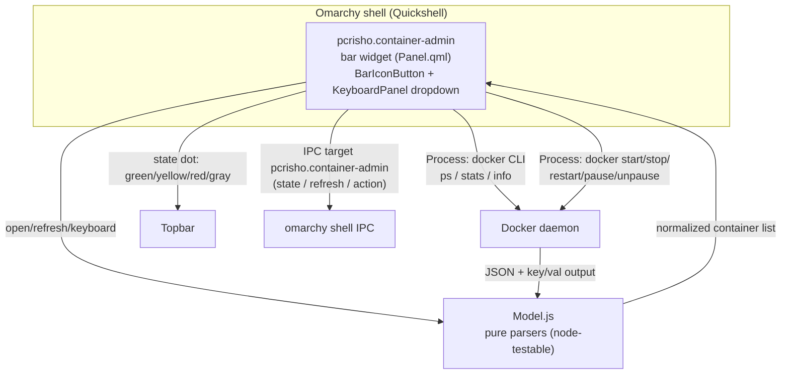

# Architecture



## Components

### 1. Widget (`Panel.qml`)

- `BarIconButton` (glyph `󰆳`) + status dot derived from the container
  states.
- `KeyboardPanel` dropdown: container list with selection cursor,
  per-row action buttons.
- Owns the IPC target `pcrisho.container-admin` (`manageIpc: false`, same
  pattern as `pcrisho.power-admin`).
- `Timer` poll (default 10s) + refresh on open + manual `r`/middle click.

### 2. Data layer (`Model.js`)

Pure functions, no Qt dependencies — testable with `node`:

- `parsePsLines(raw)` → containers: id, name, image, state, status.
- `parseStatsLines(raw)` → map name → { cpuPct, memPct }.
- `mergeStats(containers, stats)` → joins stats (running containers only).
- `stateGlyph(state)` / `stateColor(state, unhealthy)` → UI mapping.
- `worstState(containers)` / `runningCount(containers)` / `dotColor(worst)`
  → bar status dot + tooltip count.
- `clampPollInterval(sec)` → 5–300s validation.
- `parseInspect(json, id)` — planned for tier 3 (compose project labels).

### 3. Data collection (inline snapshot script)

One `Process` runs a snapshot (sectioned output — container names cannot
contain `=`, so `==SECTION==` markers are unambiguous). `docker stats` is
the expensive part (~2s) and is only run while the dropdown is open, where
the percentages are visible; the poll timer and bar tooltip only need
`ps` + daemon state:

```
==PS==     docker ps -a --format '{{json .}}'          (always)
==STATS==  docker stats --no-stream --format '{{json .}}'  (only when panel open, $1 = "stats")
==DAEMON== docker info exit code (daemon reachability) (always)
```

### 4. Actions (one Process at a time)

`docker start|stop|restart|pause|unpause <name>` — serialized via the
`actionBusy` flag (requests while busy are ignored); a non-zero exit sets a
generic footer error (`lastError`) and the list is re-refreshed. Per-row
spinner / error details are planned for v1.1.

## Data flow for a toggle (example: restart)

1. User selects a container and triggers `restart`.
2. `Panel.qml` sets `actionBusy`, runs `docker restart <name>`.
3. On `onExited`, the widget re-runs the snapshot and updates the list.
4. The bar dot recomputes from the new states.

## Persistence / config

- `shell.json` entry: `{ "id": "pcrisho.container-admin", "pollIntervalSec": 10 }`.
- No state files needed in v1 (no notifications to persist).