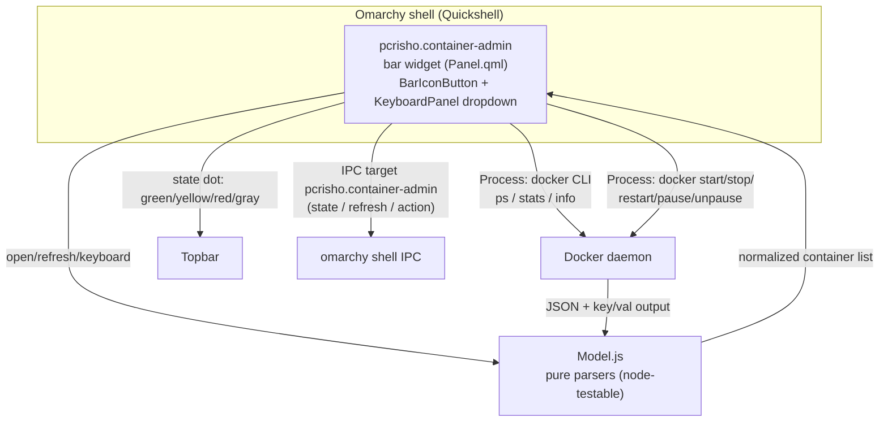

# Architecture



## Components

### 1. Widget (`Panel.qml`)

- `BarIconButton` (glyph `󰆳`) + status dot derived from the container
  states.
- `KeyboardPanel` dropdown: container list with selection cursor,
  per-row action buttons.
- Owns the IPC target `pcrisho.container-admin` (`manageIpc: false`, same
  pattern as `pcrisho.power-admin`).
- `Timer` poll (default 10s) + refresh on open + manual `r`/middle click.

### 2. Data layer (`Model.js`)

Pure functions, no Qt dependencies — testable with `node`:

- `parsePsLines(raw)` → containers: id, name, image, state, status (docker
  line-per-object and podman array schemas).
- `parseStatsLines(raw)` → map name → { cpuPct, memPct } (docker string
  percents, podman snake_case strings and numeric variants).
- `mergeStats(containers, stats)` → joins stats (running containers only).
- `stateGlyph(state)` / `stateColor(state, unhealthy)` → UI mapping.
- `worstState(containers)` / `runningCount(containers)` / `dotColor(worst)`
  → bar status dot + tooltip count.
- `clampPollInterval(sec)` → 5–300s validation.
- `parseInspect(json, id)` — planned for tier 3 (compose project labels).

### 3. Data collection (inline snapshot script)

One `Process` runs a snapshot (sectioned output — container names cannot
contain `=`, so `==SECTION==` markers are unambiguous). The script takes
two arguments: the stats gate (`$1` = `stats`|`bare` — `stats` is the
expensive part, ~2s, and only runs while the dropdown is open) and the
runtime preference (`$2` = `docker`|`podman`|`auto`). It resolves the
active runtime (auto = `docker info` succeeds, else `podman info`) and
reports it in `==RUNTIME==` so actions hit the same engine:

```
==RUNTIME==  resolved CLI: docker | podman (always)
==PS==       <runtime> ps -a --format ... (always)
==STATS==    <runtime> stats --no-stream --format ... (only when $1 = "stats")
==DAEMON==   up | down — same resolution as the runtime check (always)
```

Docker uses the `--format '{{json .}}'` line-per-object forms; podman uses
`--format json` (arrays). `Model.js` normalizes both schemas.

### 4. Actions (one Process at a time)

`<runtime> start|stop|restart|pause|unpause <name>` — the runtime comes
from the last snapshot's `==RUNTIME==` section, so an action always targets
the engine the list was read from. Actions are serialized via the
`actionBusy` flag (requests while busy are ignored); a non-zero exit sets a
generic footer error (`lastError`) with the CLI's stderr and the list is
re-refreshed. Per-row spinner / error details are planned for v1.1.

## Data flow for a toggle (example: restart)

1. User selects a container and triggers `restart`.
2. `Panel.qml` sets `actionBusy`, runs `docker restart <name>`.
3. On `onExited`, the widget re-runs the snapshot and updates the list.
4. The bar dot recomputes from the new states.

## Persistence / config

- `shell.json` entry: `{ "id": "pcrisho.container-admin", "pollIntervalSec": 10 }`.
- No state files needed in v1 (no notifications to persist).