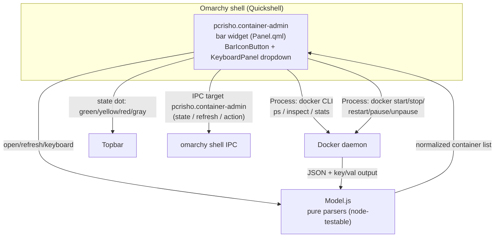

# Architecture



## Components

### 1. Widget (`Panel.qml`)

- `BarIconButton` (glyph `󰡨`) + status dot derived from the container
  states.
- `KeyboardPanel` dropdown: container list with selection cursor,
  per-row action buttons.
- Owns the IPC target `pcrisho.container-admin` (`manageIpc: false`, same
  pattern as `pcrisho.power-admin`).
- `Timer` poll (default 10s) + refresh on open + manual `r`/middle click.

### 2. Data layer (`Model.js`)

Pure functions, no Qt dependencies — testable with `node`:

- `parsePs(jsonLines)` → containers: id, name, image, state, status.
- `parseStats(jsonLines)` → map name → { cpuPct, memPct }.
- `parseInspect(json, id)` → compose project label (tier 3) etc.
- `stateGlyph(state)` / `stateColor(state)` → UI mapping.
- `summary(containers)` → worst-state dot + running count for the bar.
- `clampPollInterval(sec)` → 5–300s validation.

### 3. Data collection (inline snapshot script)

One `Process` runs a snapshot (sectioned output, `|` separator — safe: names
cannot contain `|`):

```
==PS==     docker ps -a --format '{{json .}}'
==STATS==  docker stats --no-stream --format '{{json .}}'
==ERROR==  docker info exit code (daemon reachability)
```

### 4. Actions (one Process at a time)

`docker start|stop|restart|pause|unpause <name>` — serialized via a pending
queue; UI shows a spinner on the affected row and re-refreshes on exit.

## Data flow for a toggle (example: restart)

1. User selects a container and triggers `restart`.
2. `Panel.qml` queues the action (`pendingActions`), runs
   `docker restart <name>`.
3. On `onExited`, the widget re-runs the snapshot and updates the list.
4. The bar dot recomputes from the new states.

## Persistence / config

- `shell.json` entry: `{ "id": "pcrisho.container-admin", "pollIntervalSec": 10 }`.
- No state files needed in v1 (no notifications to persist).